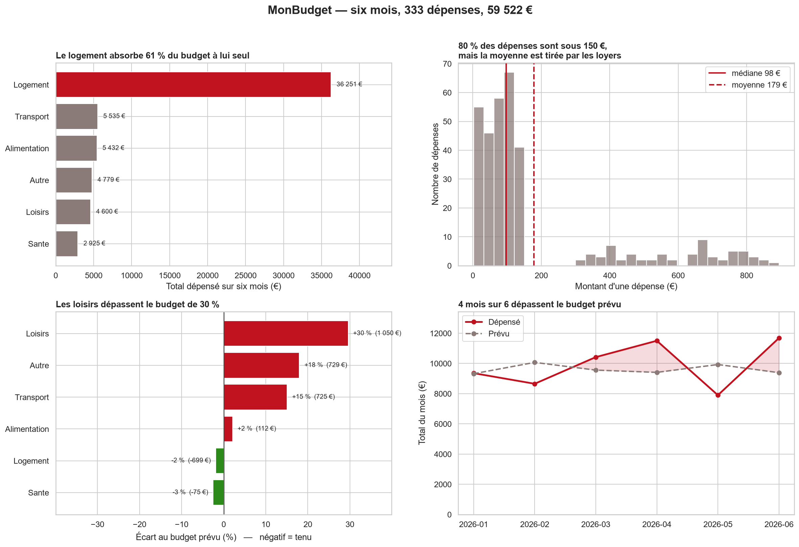

# `MonBudget` — v5-dashboard

**Séance 8 · Le tableau de bord.** Corrigé de référence.

La séance 7 a produit un relevé propre : on sait ce qu'on a dépensé. Mais
« 4 600 € de loisirs », est-ce beaucoup ? La question n'a pas de réponse
dans ce fichier — d'où la **seconde table**, et d'où `merge`.

## Les trois modules

| Fichier | Ce qu'il fait |
|---|---|
| [`donnees.py`](donnees.py) | charge, agrège, **joint** — aucun graphique |
| [`graphiques.py`](graphiques.py) | une fonction par graphique, chacune reçoit son `ax` |
| [`tableau_de_bord.py`](tableau_de_bord.py) | assemble la figure et l'exporte |

```bash
python tableau_de_bord.py
```

Les images arrivent dans [`figures/`](figures/).

## Les quatre panneaux



| Panneau | La question | Le tracé | Ce qu'on trouve |
|---|---|---|---|
| 1 | Où part l'argent ? | `barh` trié | le logement absorbe **61 %** |
| 2 | Nombreuses et petites, ou rares et grosses ? | `histplot` + médiane/moyenne | **80 %** sous 150 €, médiane 98 € contre moyenne 179 € |
| 3 | Ai-je tenu mon budget ? | `barh` de l'écart en **%** | les loisirs dépassent de **30 %** |
| 4 | Est-ce que ça dérape ? | `plot` réel contre prévu | **4 mois sur 6** dépassent |

Le panneau 3 est le seul qui a besoin des **deux** tables : c'est lui qui
justifie la jointure.

## Les deux règles d'architecture

**1. `donnees.py` ne dessine rien.** Une fonction qui rend une table se
teste ; une fonction qui affiche un graphique ne se teste pas.

**2. Chaque fonction de tracé reçoit son `ax`.**

```python
def depenses_par_categorie(df, ax):     # se compose partout
def depenses_par_categorie(df):         # crée sa figure → inutilisable
    fig, ax = plt.subplots()              dans un tableau de bord
```

C'est la même idée que « une fonction rend une valeur, elle n'affiche
pas » de la séance 4.

## Le piège de la jointure

Le budget a **une ligne par (catégorie, mois)** — 6 × 6 = 36 lignes. La clé
de jointure est donc le **couple**. Joindre sur la seule catégorie :

```
avant : 333 lignes    total :  59 521.62 €
apres : 1 998 lignes  total : 357 129.72 €
```

Aucune erreur, aucun avertissement, un total six fois trop grand. D'où
`jointure_qui_explose()` dans `donnees.py` : le piège est **fourni**, pour
qu'on puisse le montrer en séance.

Et la parade, dans le code du corrigé :

```python
assert len(croise) == len(reel), "explosion de lignes !"
```

## Le choix qui compte : euros ou pourcentage ?

Le panneau 3 trace un **pourcentage**, pas des euros — et
`reel_contre_prevu_en_euros()` existe exprès pour montrer pourquoi.

| Catégorie | Écart en € | Écart en % | Lecture |
|---|---|---|---|
| Loisirs | +1 050 € | **+30 %** | à corriger |
| Autre | +729 € | **+18 %** | à corriger |
| Transport | +725 € | **+15 %** | à corriger |
| Logement | −699 € | **−2 %** | budget tenu |

Trois écarts de ~700 € : deux sont des problèmes, un est du bruit. En
euros, ces lignes se ressemblent. Sur une échelle en euros, le logement à
36 000 € écrase de toute façon les cinq autres catégories et le
dépassement des loisirs devient invisible.

> **Les deux graphiques sont exacts. Un seul répond à la question.** Le
> choix de ce qu'on encode n'est pas cosmétique : il décide de ce que le
> lecteur pourra voir.

## Les figures annexes

| Fichier | À quoi ça sert |
|---|---|
| `axe_qui_mente.png` | la démonstration à projeter : même données, deux axes |
| `carte_de_chaleur.png` | le tableau croisé en couleurs — repérer une anomalie |
| `montant_contre_jour.png` | un **non-résultat** assumé (r = −0,04) |
| `tableau_de_bord.svg` | la version vectorielle, pour projeter ou imprimer |

## Les données

- `data/releve_propre.csv` — 333 dépenses, produit par
  [`v4-donnees`](../v4-donnees/)
- `data/budget_prevu.csv` — 36 lignes, produit par
  `python data/generer_budget_prevu.py` (graine fixe : reproductible)

## Ce qui manque à cette version

Rien de technique — c'est la dernière. Mais le tableau de bord est
**statique** : il faut relancer le script pour le mettre à jour. La suite
naturelle serait une petite application web (Streamlit, ou FastAPI +
Chart.js). C'est exactement l'un des quatre chemins proposés en clôture.
